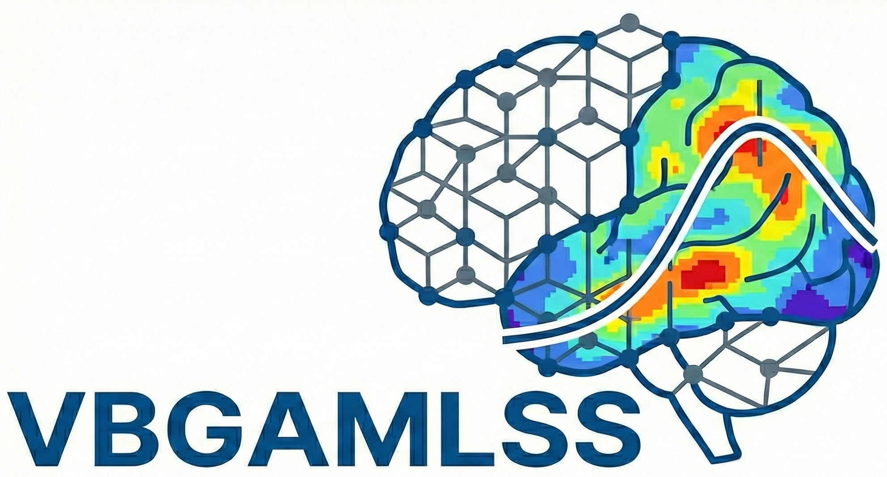

# Voxel or Vertex-Based GAMLSS

[](https://cran.r-project.org/)
[](LICENSE)
[](#)
[](https://github.com/tmspvn/VBGAMLSS/issues)

***VBGAMLSS*** fits ***Generalized Additive Models for Location, Scale and Shape*** voxel-wise or vertex-wise, designed for normative modelling in neuroimaging.
VBGAMLSS is based on [gamlss2](https://gamlss-dev.github.io/gamlss2/), so it uses the same formula syntax.
---


## 📦 Requirements

```
ANTsR
doFuture
gamlss
gamlss2
itertools
pbmcapply
progressr
tibble
```

---

## 🔧 Installation

### Install `gamlss2` and `ANTsR`

```r
# devtools is required to install from GitHub
install.packages("devtools")

# gamlss2 from R-universe and ANTsR from GitHub
install.packages(
  "gamlss2", 
  repos = c("https://gamlss-dev.R-universe.dev", 
            "https://cloud.R-project.org")
)

# Note for vertex based data ANTsR is not mandatory
devtools::install_github("ANTsX/ANTsR")
```

### Install `VBGAMLSS`

```r
devtools::install_github("tmspvn/VBGAMLSS", dependencies = TRUE)
```

Note: VBGAMLSS is heavily based on [gamlss2](https://github.com/gamlss-dev/gamlss2) which is under development so changes are common. If you encounter issues, please let me know.

---

## 🎭 Quick Start

```r
library(VBGAMLSS)

# Paths to example data
nsubj <- 258
img_controls <- "~/controls.nii.gz"  # 90x90x90x258
img_patients <- "~/patients.nii.gz"  # 90x90x90x258
mask <- "~/mask.nii.gz"      # 90x90x90


# Covariates
covs_controls <- data.frame(
  x0  = 1:nsubj,
  x1 = as.factor(rbinom(nsubj, 1, 0.6)),
)

covs_patients <- data.frame(
  x0  = rnorm(nsubj),
  x1 = rnorm(nsubj) * rnorm(nsubj),
)


# Convert to 2D subject × voxel/vertex
imageframe_controls <- images2matrix(img_controls, mask)
imageframe_patients <- images2matrix(img_patients, mask)


# Fit the voxel-wise GAMLSS models. Note: formulas follow gamlss2 syntax, 
#  but the Y is the response variable placeholder is mandatory. 
vbgamlss_model <- vbgamlss(
  imageframe_controls,
  g.formula = Y ~ pb(x0) + x1 | x1,
  g.family  = NO,
  num_cores = 20,
  train.data = covs_controls,
  debug = TRUE
)
```

#### After a great amount of time... 

```r
# Save / load
save_model(vbgamlss_model, "~/vbgamlss.model/fitted_model")
models_loaded <- load_model("~/vbgamlss.model/fitted_model.vbgamlss")


# Predict & compute Z-scores
predictions <- predict.vbgamlss(models_loaded, newdata = covs_patients)
zscores <- zscore.vbgamlss(predictions, imageframe_patients)


# Map the z-score to nifti. `_subj-<ID>.zscore.nii.gz` is then appended. 
#  ID id the patient index of the imageframe. 
#  Note, this function computes z-scores from a `vbgamlss.predictions" object. 
#  It differes from the `map_zscores_from_map` function which computes the maps 
#  z-scores directly from coefficient maps.
map_zscores(
  zscores,
  mask = mask,
  filename = "~/patients_deviation_maps/deviation_map",
)


# Map the predicted μ,σ,ν,τ response distribution parameters to nifti. `_subj-<ID>_fam-<FAMILY>_par-<PARAM>.nii.gz` is then appended. FAMILY is the distribution family (e.g. SHASH), PARAM is the parameter (e.g. mu, sigma).
map_model_predictions(
  predictions,
  mask = mask,
  filename = "~/patients_parameter_maps/prediction", 
)

```

---

## 📚 Functions Overview

### Core
| Function | Description |
|----------|-------------|
| [`vbgamlss`](https://github.com/tmspvn/VBGAMLSS/blob/master/R/Core.R#L15) | Fit GAMLSS voxel/vertex-wise with optional segmentation and parallel processing. Process the data in chunks. |


### Support & Utility
| Function | Description |
|----------|-------------|
| [`images2matrix`](https://github.com/tmspvn/VBGAMLSS/blob/master/R/Utilities.R#L2) | Convert 4D NIfTI/list of 3D images to subject × voxel matrix. |
| [`load_input_image`](https://github.com/tmspvn/VBGAMLSS/blob/master/R/Utilities.R#L40) | Load image/matrix from NIfTI, RDS, or data frame. |
| [`save_model`](https://github.com/tmspvn/VBGAMLSS/blob/master/R/Support.R#L10) | Save fitted `vbgamlss` models to file.|
| [`load_model`](https://github.com/tmspvn/VBGAMLSS/blob/master/R/Support.R#L22) | Load saved `vbgamlss` models from file.|
| [`predict.vbgamlss`](https://github.com/tmspvn/VBGAMLSS/blob/master/R/Support.R#L32) | Predict parameters or responses from fitted models. |
| [`zscore.vbgamlss`](https://github.com/tmspvn/VBGAMLSS/blob/master/R/Support.R#L147) | Compute per-voxel z-scores. |
| [`restore_family`](https://github.com/tmspvn/VBGAMLSS/blob/master/R/Utilities.R#L101) | For space efficiency reason, vbgamlss remove the distribution class from each submodel after fitting. use this function to restore it if needed (e.g. if you want to do custom operation on vbgamlss submodels). |
| [`vbapply`](https://github.com/tmspvn/VBGAMLSS/blob/master/R/Utilities.R#L118) | Apply a function to each voxel submodel in a vbgamlss object and return a vector. restore_family() is already included in each iteration before calling the custom function. |


### Mapping
| Function | Description |
|----------|-------------|
| [`map_model_coefficients`](https://github.com/tmspvn/VBGAMLSS/blob/master/R/Mapping.R#L2) | Save per-voxel model coefficients to NIfTI images (e.g. β coeff. of a regression model as maps). |
| [`map_model_predictions`](https://github.com/tmspvn/VBGAMLSS/blob/master/R/Mapping.R#L52) | Save predicted parameters to NIfTI images (i.e. save μ,σ,ν,τ distribution coeff. as a maps). |
| [`map_zscores`](https://github.com/tmspvn/VBGAMLSS/blob/master/R/Mapping.R#L116) | Save z-score maps to NIfTI images. |
| [`map_zscores_from_map`](https://github.com/tmspvn/VBGAMLSS/blob/master/R/Mapping.R#L168) | Compute and save z-score directly from coefficients maps (i.e. after `map_model_predictions`). |


### Cross-validation
| Function | Description |
|----------|-------------|
| [`vbgamlss.cv`](https://github.com/tmspvn/VBGAMLSS/blob/master/R/Cross_validation.R#L1) | Perform stratified k-fold cross-validation for voxel-wise models and summaries results. |

---

## 📝 General notes

* Using an HPC is strongly encouraged. Fitting models voxel-wise is computationally and memory intensive and may take a long time.
* Please consider tweaking `chunk_max_mb` parameter of `vbgamlss` to fit your system's memory constraints (256Mb is a good starting point). The function will proceed chunking the imageframe and parallize a chunk at the time to avoid loading everyhting in memory at once.
* When performing model selection is advise to do it on a subset of voxels (regularly or randomly sampled) with a penalized likelihood (e.g. `GAIC` with `k=2` or `k=log(n)`) method instead of CV for time reasons. 
* Providing an already subsampled mask is simple and effective. `vbgamlss`'s `subsample` parameter is DEPRECATED.
* `vbgamlss` can be forced to save each chunk and resume the fit from the last chunk in case of interruptions (e.g. time limits on HPC) by providing `cache=T` and `cachedir`. See `?vbgamlss` for details.

---

## 🏗️ Work in progress

* `vbgamlss.cv`: ⚠️ implemented, but not fully tested. Undocumented.
* `vbgamlss` segmentation handling: ⚠️ implemented, but not fully tested.
* `vbgamlss.model_selection`: ❌ "It will not work on other HPC systems. Undocumented.

---

## ⚠ Known Issues

* It takes a long time to fit models voxel-wise.
* pbmcappyly runs sequentially on some systems (i.e. Windows).
* `vbgamlss.model_selection` currently does not generalize across all HPC systems 

---

<details>
<summary> All Functions (click to expand)</summary>

### Core
| Function | Description |
|----------|-------------|
| [`vbgamlss`](https://github.com/tmspvn/VBGAMLSS/blob/master/R/Core.R#L15) | Fit GAMLSS voxel/vertex-wise with optional segmentation and parallel processing. |


### Cross-validation 
| Function | Description |
|----------|-------------|
| [`vbgamlss.cv`](https://github.com/tmspvn/VBGAMLSS/blob/master/R/Cross_validation.R#L1) | Perform stratified k-fold cross-validation for voxel-wise models and summarise deviance. |
| [`predictGD`](https://github.com/tmspvn/VBGAMLSS/blob/master/R/Cross_validation.R#L90) | Predict parameters/responses and compute global deviance per voxel. |
| [`testGD`](https://github.com/tmspvn/VBGAMLSS/blob/master/R/Cross_validation.R#L247) | Compute deviance, prediction error, and residuals for a voxel. |
| [`statGD`](https://github.com/tmspvn/VBGAMLSS/blob/master/R/Cross_validation.R#L353) | Summarise deviance and prediction error across voxels. |
| [`describe_stats`](https://github.com/tmspvn/VBGAMLSS/blob/master/R/Cross_validation.R#L400) | Return mean, SD, quantiles, min, max for a vector. |
| [`stratCVfolds`](https://github.com/tmspvn/VBGAMLSS/blob/master/R/Cross_validation.R#L411) | Generate stratified fold assignments from a factor. |
| [`getCVGD`](https://github.com/tmspvn/VBGAMLSS/blob/master/R/Cross_validation.R#L423) | Aggregate global deviance across CV folds. |
| [`getCVGD.pen`](https://github.com/tmspvn/VBGAMLSS/blob/master/R/Cross_validation.R#L435) | Aggregate penalised global deviance across CV folds. |
| [`getCVGD.all`](https://github.com/tmspvn/VBGAMLSS/blob/master/R/Cross_validation.R#L439) | Aggregate both penalised and unpenalised deviance. |
| [`akaike_weights`](https://github.com/tmspvn/VBGAMLSS/blob/master/R/Cross_validation.R#L451) | Compute AIC/Akaike model weights. |


### Mapping
| Function | Description |
|----------|-------------|
| [`map_model_coefficients`](https://github.com/tmspvn/VBGAMLSS/blob/master/R/Mapping.R#L2) | Save per-voxel model coefficients to NIfTI images (e.g. β coeff. of a regression model as map). |
| [`map_model_predictions`](https://github.com/tmspvn/VBGAMLSS/blob/master/R/Mapping.R#L52) | Save predicted parameters to NIfTI images (i.e. save μ,σ,ν,τ distribution coeff. as a map). |
| [`map_zscores`](https://github.com/tmspvn/VBGAMLSS/blob/master/R/Mapping.R#L116) | Save z-score maps to NIfTI images. |


### Model-selection 
| Function | Description |
|----------|-------------|
| [`vbgamlss.model_selection`](https://github.com/tmspvn/VBGAMLSS/blob/master/R/Model_selection_system.R#L2) | Run multi-model CV jobs on HPC (Slurm). |
| [`slurm_template`](https://github.com/tmspvn/VBGAMLSS/blob/master/R/Model_selection_system.R#L178) | Return a Slurm job script template. |
| [`slurm_resources`](https://github.com/tmspvn/VBGAMLSS/blob/master/R/Model_selection_system.R#L200) | Build Slurm resource parameter list. |
| [`slurm_registry`](https://github.com/tmspvn/VBGAMLSS/blob/master/R/Model_selection_system.R#L214) | Create registry for job tracking. |
| [`sanity_check`](https://github.com/tmspvn/VBGAMLSS/blob/master/R/Model_selection_system.R#L238) | Verify required files exist before running. |
| [`sbatch_jobs`](https://github.com/tmspvn/VBGAMLSS/blob/master/R/Model_selection_system.R#L250) | Submit jobs to Slurm. |
| [`jobs_status`](https://github.com/tmspvn/VBGAMLSS/blob/master/R/Model_selection_system.R#L270) | Query Slurm job statuses. |
| [`monitor_jobs`](https://github.com/tmspvn/VBGAMLSS/blob/master/R/Model_selection_system.R#L286) | Monitor jobs until completion. |
| [`gather_jobs_outputs`](https://github.com/tmspvn/VBGAMLSS/blob/master/R/Model_selection_system.R#L368) | Collect outputs from all jobs. |


### Support
| Function | Description |
|----------|-------------|
| [`save_model`](https://github.com/tmspvn/VBGAMLSS/blob/master/R/Support.R#L10) | Save fitted `vbgamlss` models to file. |
| [`load_model`](https://github.com/tmspvn/VBGAMLSS/blob/master/R/Support.R#L22) | Load saved `vbgamlss` models from file. |
| [`predict.vbgamlss`](https://github.com/tmspvn/VBGAMLSS/blob/master/R/Support.R#L32) | Predict parameters or responses from fitted models. |
| [`zscore.vbgamlss`](https://github.com/tmspvn/VBGAMLSS/blob/master/R/Support.R#L147) | Compute per-voxel z-scores. |


### Utilities
| Function | Description |
|----------|-------------|
| [`images2matrix`](https://github.com/tmspvn/VBGAMLSS/blob/master/R/Utilities.R#L2) | Convert 4D NIfTI/list of 3D images to subject × voxel matrix. |
| [`load_input_image`](https://github.com/tmspvn/VBGAMLSS/blob/master/R/Utilities.R#L40) | Load image/matrix from NIfTI, RDS, or data frame. |
| [`restore_family`](https://github.com/tmspvn/VBGAMLSS/blob/master/R/Utilities.R#L101) | For space efficiency reason, vbgamlss remove the distribution class from each submodel after fitting. use this function to restore it if needed (e.g. if you want to do custom operation on vbgamlss submodels). |
| [`vbapply`](https://github.com/tmspvn/VBGAMLSS/blob/master/R/Utilities.R#L118) | Apply a function to each voxel submodel in a vbgamlss object and return a vector. restore_family() is already included in each iteration before calling the custom function. |
| [`estimate_nchunks`](https://github.com/tmspvn/VBGAMLSS/blob/master/R/Utilities.R#L88) | Calculate chunks to fit memory constraints. |
| [`get_subsample_indices`](https://github.com/tmspvn/VBGAMLSS/blob/master/R/Utilities.R#L100) | Generate indices for subsampling. |
| [`combine_formulas_gamlss2`](https://github.com/tmspvn/VBGAMLSS/blob/master/R/Utilities.R#L131) | Merge formulas for mu, sigma, nu, tau models. |
| [`quite`](https://github.com/tmspvn/VBGAMLSS/blob/master/R/Utilities.R#L177) | Suppress console output of an expression. |
| [`rand_names`](https://github.com/tmspvn/VBGAMLSS/blob/master/R/Utilities.R#L185) | Generate random string IDs. |
| [`check_formula_LHS`](https://github.com/tmspvn/VBGAMLSS/blob/master/R/Utilities.R#L190) | Ensure formula LHS is `Y`. |
| [`TRY`](https://github.com/tmspvn/VBGAMLSS/blob/master/R/Utilities.R#L200) | Try-catch with error/warning logging. |

</details>


